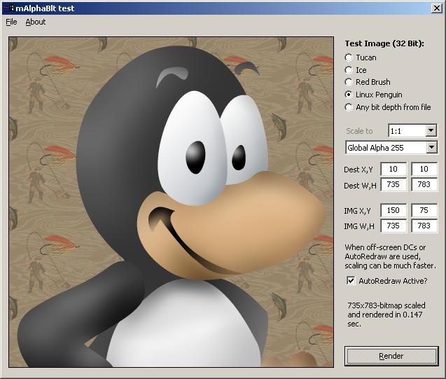



## AlphaBlend for all O/S \- Originally by Carles

### Description

(Updated) Carles posted a very excellent alphablend &amp; stretch routine that did not rely on the AlphaBlend API. Original post is txtCodeId=60424. This is my spin on his code adding some functionality not previously available. Changes include blending non-32bit images, using clipping to speed up some stretched images, adding options to stretch portions of images, offering a global alpha blend option along with per pixel alphas. However, the added overhead can prove to be slightly slower than Carles' original routines. You should test &amp; compare against his original code. ALL VOTES SHOULD GO to his post (txtCodeId=60424). Modified 23Jan/22:30zulu to handle negative DC offsets &amp; fix known calculation errors. Tweaked 24Jan/1609z for speed. 26Jan/1700z: final safety checks added; minor speed improvements
 
### More Info
 

             |
---                |---
**Submitted On**   |2006-01-22 11:14:02
**By**             |[LaVolpe](https://github.com/Planet-Source-Code/PSCIndex/blob/master/ByAuthor/lavolpe.md)
**Level**          |Intermediate
**User Rating**    |5.0 (60 globes from 12 users)
**Compatibility**  |VB 5\.0, VB 6\.0
**Category**       |[Graphics](https://github.com/Planet-Source-Code/PSCIndex/blob/master/ByCategory/graphics__1-46.md)
**World**          |[Visual Basic](https://github.com/Planet-Source-Code/PSCIndex/blob/master/ByWorld/visual-basic.md)
**Archive File**   |[AlphaBlend1968191262006\.zip](https://github.com/Planet-Source-Code/lavolpe-alphablend-for-all-o-s-originally-by-carles__1-64110/archive/master.zip)

